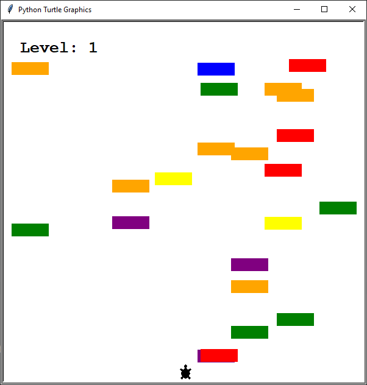

## Turtle Crossing Game (Python)

Projekt przedstawia prostą grę zręcznościową napisaną w Pythonie z wykorzystaniem biblioteki `turtle`. Gracz steruje żółwiem, którego zadaniem jest przejście przez drogę pełną nadjeżdżających samochodów. Gra posiada system poziomów, rosnącą trudność oraz wykrywanie kolizji.

---

## Cel projektu

Celem projektu jest stworzenie kompletnej gry 2D, która:

- wykorzystuje programowanie obiektowe (OOP),
- generuje dynamiczne obiekty (samochody),
- reaguje na zdarzenia klawiatury,
- posiada logikę kolizji,
- zwiększa poziom trudności wraz z postępem gracza,
- prezentuje podstawy tworzenia gier w Pythonie.

Projekt pokazuje umiejętność pracy z modułami, klasami, pętlą gry oraz prostą grafiką.

---

## Technologie

- **Python 3**
- **turtle** – grafika i obsługa zdarzeń
- **time** – kontrola prędkości gry
- **random** – losowanie pozycji i liczby samochodów

---

## Zrzuty ekranu

### Poziom 1 – rozgrywka


*przykładowy widok gry na pierwszym poziomie. Gracz steruje żółwiem, unikając samochodów poruszających się z prawej strony ekranu.*


### Poziom 2 – GAME OVER


*Ekran drugiego poziomu z komunikatem „GAME OVER”, prezentujący działanie systemu poziomów oraz ekran końcowy po kolizji.*


---

## Funkcjonalności gry

- Sterowanie żółwiem za pomocą klawisza **Up**
- Losowe generowanie samochodów o różnych kolorach
- Kolizje kończące grę
- System poziomów – po dotarciu do mety poziom wzrasta
- Rosnąca prędkość samochodów na każdym poziomie
- Wyświetlanie aktualnego poziomu
- Komunikat „GAME OVER” po przegranej

---

## Struktura projektu

- `main.py` – główna pętla gry i obsługa logiki
- `player.py` – klasa gracza (żółwia)
- `car_manager.py` – generowanie i poruszanie samochodów
- `scoreboard.py` – wyświetlanie poziomu i komunikatów

---

## Opis klas

### Player
- odpowiada za ruch żółwia,
- sprawdza, czy gracz dotarł do mety,
- resetuje pozycję po awansie na kolejny poziom.

### CarManager
- generuje samochody w losowych miejscach,
- porusza je w lewo,
- zwiększa prędkość po każdym poziomie.

### Scoreboard
- wyświetla aktualny poziom,
- czyści ekran i aktualizuje wynik,
- wyświetla komunikat „GAME OVER”.

---

## Uruchomienie

Wymagania: Python 3.x

Uruchomienie gry:

```bash
python main.py
```

Okno gry otworzy się automatycznie.

---

## Możliwe ulepszenia

- dodanie menu startowego,
- zapis najwyższego wyniku,
- różne tryby trudności,
- dźwięki i animacje,
- ulepszona grafika samochodów i gracza.
